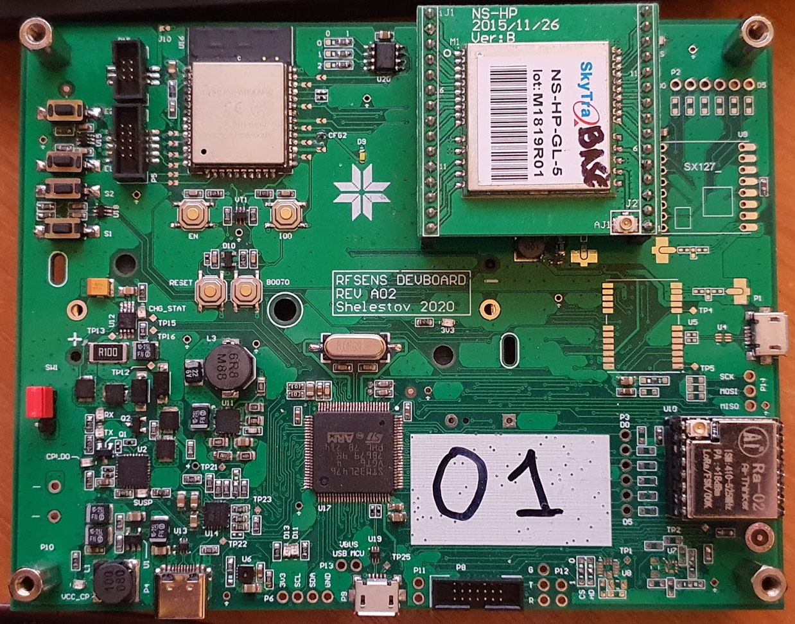
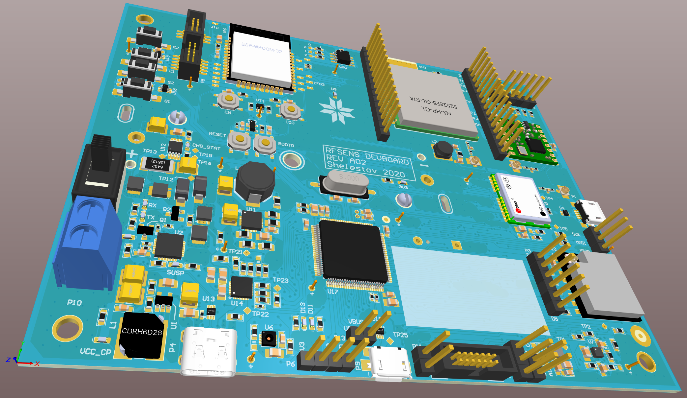
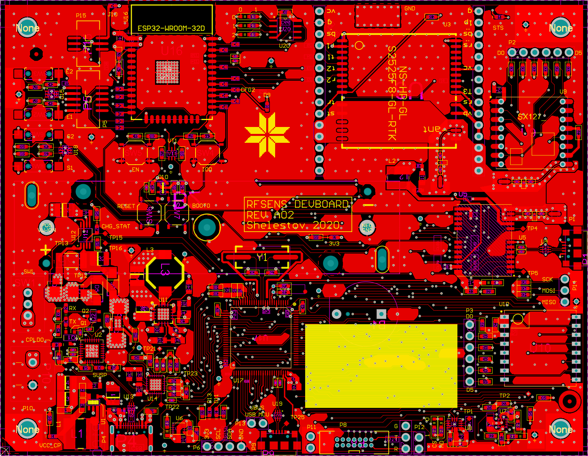
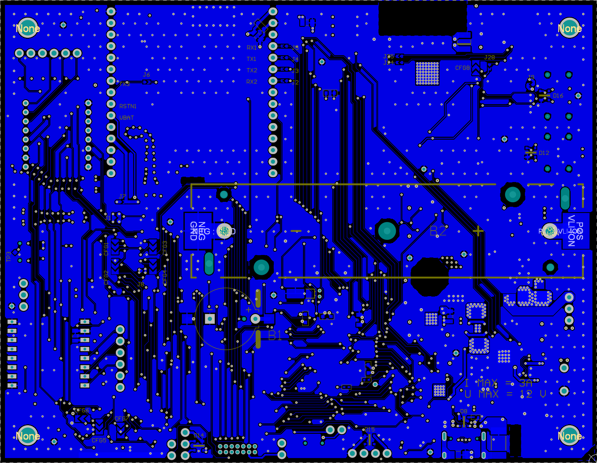

# RFSENS DEVBOARD

STM32 based devboard for IMU sensors with RTK GPS and LoRa modems

[Quick Schematic, BOM, DRC and Assembly](RFSENS-Altium/RFSENS.pdf)

## Actual device:

## Render:

## TOP:

## BOT:

